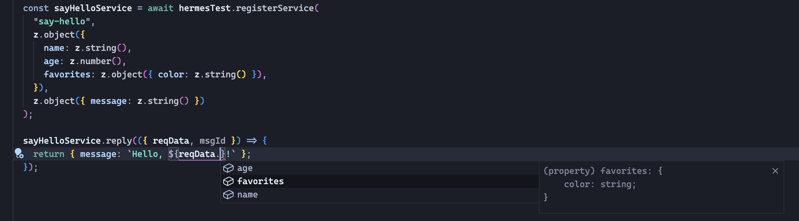
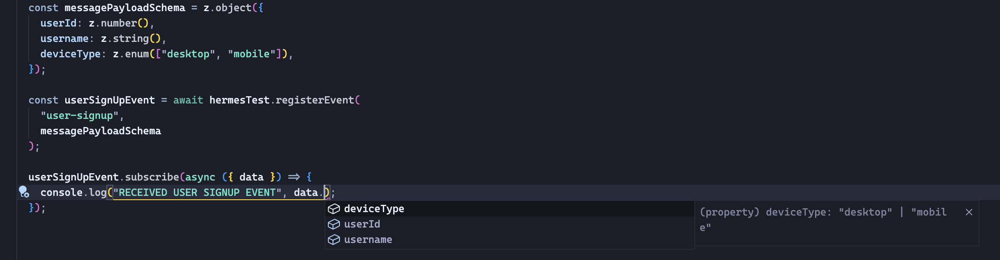

# Hermes

Type safe message bus, and "request-response" style services. Powered by Redis Streams

# Features

- Type-safety
- Schema validation with [Zod](https://github.com/colinhacks/zod)
- Horizontally scalable
- Message acknowledgement and failover across consumers

# Example

Type-Safe Service

Type-Safe Message Bus

# Improvement Ideas

- [ ] Connection Pooling for Redis
- [x] Consumer transfer on timeout
- [ ] Custom Logger
  - [ ] log levels
- [ ] Worker threads for subscriptions
- [ ] Better observability tools

### New Features

- [ ] Job scheduler

# Contributing
